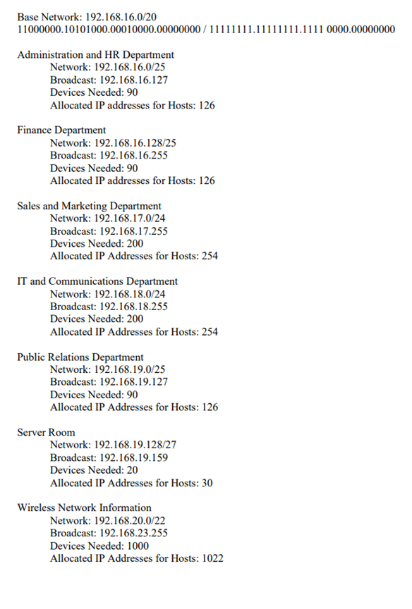


# 🖧 Company Network Project in Cisco Packet Tracer

# Description

An enterprise company has hired you to set up a LAN for their new headquarters in Krakow. The following are the requirements for the Network you will establish in the new building.

1. Use Cisco Packet Tracer to implement solution.
2. The network address that the company allocated is 192.168.1.0/20
3. Various departments work on each floor of the 4-storey building. Each of these departments will have different VLANs and different subnetworks.
4. On the third floor, there will be a wireless access point to which a maximum of 1000 devices can be connected.
5. There should be a core router connected to the ISP, and two multilayer switches connected to this core router.
6. Devices in all departments are required to communicate with each other with the respective multilayer switch configured for inter-VLAN routing.
7. The multilayer switches are expected to carry out both routing and switching.
7. All devices in the network are expected to obtain an IP address dynamically from the DHCP server located at server room.
9. Devices in the server room are to be allocated IP addresses statically.
10. Use OSPF as the routing protocol to advertise routes between routers and multilayer switches.
11. Configure NAT on core router.

# Implementation
## 1. Subnetting

## 2. Topology

- OSPF used as routing protocol on the routers and multi-layer switches.
- NAT configured on core router.
- Multi-layer switches configured for inter-VLAN routing.
- Ports between multi-layer switches and 2960 model switches configured as trunk ports.
- Ports between 2960 model switches and end-devices configured as access ports.
- Access Point has a password on WPA2-PSK Authentication. Since smart phone in public relations department doesn’t have correct password, it’s not connected to the wireless network.

## 3. Configurations

### ISP Router Configuration

### Core Router Configuration

### Multi-Layer Switches Configuration

Multi-layer S2 has similar configuration as Multilayer S1. We don't need to show all the configurations again for Multilayer S2.

### Layer 2 Switches Configuration

### DHCP Server Configuration

# Testing

### 1. Testing DHCP

### 2. Ping Testing

### 3. Testing NAT

### 4. Testing DNS

